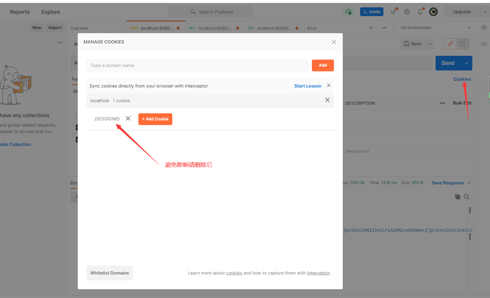

### Springboot整合Shiro+JWT（Helloworld）

1. 导入hello.sql文件

   | id   | username | password | roles | pemission | salt |
   | ---- | -------- | -------- | ----- | --------- | ---- |
   |      |          |          | 角色  | 权限      | 加盐 |

   id后期可以用雪花算法生成，roles和permission应该是分表的，减少冗余，这里只是简单的示例。

2. 导入pom文件后，目录结构如下所示

  

3. 测试需要使用Postman比较直观

    

    

    

